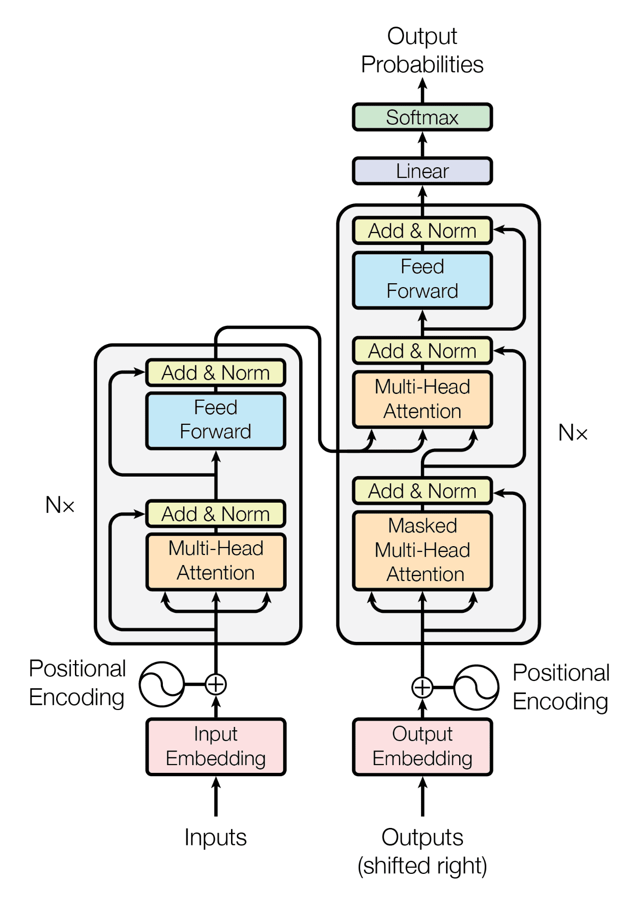

## Summary of the class

### Syallbus Overview

- Use AI to design websites
- Use AI to improve website quality
- Learn 5% research concepts behind genAI

### Understanding AI at core

- What an AI is ?
- ML vs genAI

### How genAI works internally

### AI jargons

- tokenization
- Encoding libraries
- Vocabulary size
- vector embedding
- positional encoding
- self attention mechanism
- multi head attention
- Feed forward layer
- Phases of a model
- Knowledge Cutoff

### Assignments

- Decoding AI Jargons with chai
- Write your own tokenizer from scratch

> ## Class note starts here

### Syallbus Overview

- A genAI developer focus 95% of developing something using AI and 5% in the core of AI
- A ML developer focus 95% of core of AI and 5% of developing something like website or more.

## Understanding AI at core

### What AI does ?

- It predicts the next token of the input given by user.
  Eg:- When we write "I am"
- AI try to predict about the next word.
  - If my data like my name, gender present near the AI website(Eg:- Chatgpt(openai)). It predicts Priyansu which is my name.
  - If my name is not save it predicts from its training words (billions of words)

---

### History of openai and google gemini

#### OpenAI :-

- OpenAI built its first gpt named gpt on 2018.

  > gpt - generative pretrained transformer

- When we ask current news or current weather to a gpt it can not give answer but chatgpt and google gemini can say because they call tools like searching in the web and give you perticular answer.
- They are the agents. Gpt + tools calling

##### Why Gpt can not give answer about current situation ?

- Because Gpt are trained for a perticular time.
  Eg:- If openai gpt trained on 2nd May 2025, It has knowledge till then. After 2nd May it has no datas in its database.
- So we can call it knowledge cutoff.

#### Google gemini :-

- Google's Gemini, initially known as Bard, is a family of large language models (LLMs) and a chatbot, developed by Google DeepMind.
- Before all AIs, Google made a paper named Attention is all you need 2017. which is an AI foundation paper.
  

---

### AI Jargons

> When we write something in chatgpt or google gemini input field then what happen behind the scene and after giving the query to AI then what the scenario of behind the scene. Mainly question is this how Chatgpt or google gemini gives us answer about our query ?

- When we type something like "I am \_\_\_\_" Genai try to predict the next token or word or character after each word or character when we type.
- As we know if chatgpt knows my name (save in its data) then it guess like "Priyansu", "a boy", "sad", "happy" and etc.
- If it does not know it guess the word from its database where billions of words present.

> After giving query to AI

#### Input and Encoding :-

- Computer can understand math only.
- Gpt models firstly make token all of the words which is known as tokenization

  Eg:- Priyansu eats chocolates

#### Tokenization :-

- Models uses libraries for tokenization.
  - Eg:- OpenAI uses tiktoken
- From tokens models make it vectors form known vector embeddings
  - Eg:- [1.2564466, 2.6797823, 1.6723398]

#### Position encoding:-

- When we write "Priyansu eats chocolate" and "chocolate eats Priyansu" then their tokens are same but here we need postional encoding for getting the data aqurate in vector embeddings.
- So, in vector embeddings their values are different.

#### Self attention mechanism:-

- We give chance to tokens to talk with each other and update yourself in self attention mechanism.
- In technical term, When we input a sentence into a transformer (like GPT or BERT), each token doesn't just sit there alone — it looks at (attends to) all the other tokens to understand the context.
- Imagine this:
- Sentence: "Priyansu eats chocolate"

- Each word (token) asks:

- What do the other tokens mean to me ?

- How important are they for my meaning ?

- So:

  - "Priyansu" attends to "eats" and "chocolate"

  - "eats" attends to "Priyansu" and "chocolate"

  - "chocolate" attends to "eats" and "Priyansu"

  - This is “tokens talking to each other” — mathematically done using attention scores.

- In self attention we have one head always.

#### Feed forward layer:-

- In transformers, the Feed Forward Layer is a small 2-layer neural network that processes each token’s embedding individually (after self-attention).
- Think of it as:

  > "After a token has listened to all others (via self-attention), it now gets its own private mini neural network to fine-tune its representation."
  > **Even though self-attention allows tokens to interact and gather context, it’s the feed-forward layer that adds expressiveness to each token’s representation — which is crucial in generation tasks where the model must produce the most likely next token based on learned patterns.**

#### Linear layer:-

- A linear layer (also called a fully connected or dense layer) is a matrix multiplication followed by a bias addition.

  > In transformers, a linear layer is a fully connected layer used for transforming token embeddings through matrix multiplication and bias addition. It's used throughout the model — to project inputs into queries, keys, and values for self-attention, to combine multi-head outputs, and inside the feed-forward network. These layers help the model learn deep representations and map internal states to the output vocabulary during generation.
