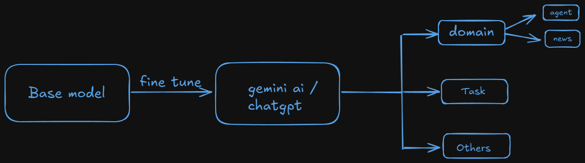
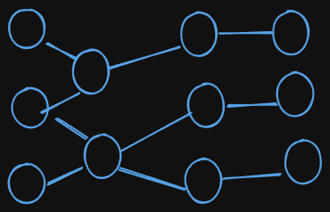

# Summary of the class

- A to A Protocol
- Fine tuning
  - Base model
  - Types of fine tuning
    - Full parameter fine tuning
    -

# Notes

## A to A protocol :-

- Refer to A2A Protocol in GenAI is a communication method where autonomous agents interact with each other to share information, delegate tasks, or collaborate toward a common goal — without needing constant human input.
- Types of communication protocol designed to allow two software apllications to communicate directly with each other.
- In modern GenAI systems (especially using frameworks like LangGraph, AutoGen, or CrewAI), agents are:
  - Specialized AI entities
  - Given specific roles (e.g., Data Analyst, Coder, Researcher)
  - Operate semi-autonomously
  - Can talk to each other using natural language or structured data
- Example :-

  - Suppose you have an AI research assistant system:
  - Agent A (Researcher): Gathers latest papers on "LLM optimization"
  - Agent B (Summarizer): Summarizes the papers
  - Agent C (Writer): Writes a blog post based on the summary
  - In an A2A protocol, these agents pass messages to each other, possibly using a prompt format like:

  ```pgsql
  [Researcher -> Summarizer]: Here's a paper summary.
  [Summarizer -> Writer]: Here's the summarized content.
  ```

### Difference between A2A and H2A

| Type    | Description                                     |
| ------- | ----------------------------------------------- |
| **A2A** | Agent-to-Agent communication                    |
| **H2A** | Human giving input to agent (e.g., user prompt) |

## Fine tuning :-

- A fine-tuning is a process of training a pre-trained model on a smaller task-specific dataset, which allows the model to learn to perform a specific task more effectively.
  

### Strategies of fine tuning :-

- Needed for machine learning researcher
- Types:-
  - Full parameter fine tuning
  - LoRA fine tuning

#### 1. **Full parameter fine tuning :-**

- We change actual weights of the model.

  

- Analogy :-

  - Jab ek bachha ko kisika face dikhake sikhaya jaata hai ki wo aapka father hai aur sirk image dekh ke pehchan raha hai jab unke father samne aayenge tab uss bache ka dimag me kuchh image chalega jab wo insaan jo uska samne khada hai uske father ke image se match hoga wo pehchane jayega ki wo uske father hai, yahan weights change hota hai

  - Let’s walk through it again:

    - Jab ek bachha ko kisika face dikhake sikhaya jaata hai ki wo aapka father hai...

    - Yes, this is like training the model using new examples.

    - In my example:

      - The baby’s brain = Pre-trained LLM

      - The father's image shown repeatedly = Fine-tuning dataset

      - The baby forming an internal mental image = Model updating weights

      - When the actual person comes, the baby recognizes = Model predicts/output correctly

      - So yes, baby ke brain me jo internal image bana (which was shaped by training), wo weights ka role hai.

      - When you fine-tune, you're changing those inner images (the weights), so the model can better recognize or generate outputs for the new task.

      > ##### **What is weights** ? :-

      - Weights are the learnable parameters in a neural network that determine how much influence an input has on the output.
      - In Simple Terms:
        - A weight is a number.
        - It controls the strength of a connection between two neurons.
        - The model learns by adjusting these weights during training to reduce error.
      - Analogy :-
        - In my previous bache wale analogy:-
          - input - Papa ki photo (jo dikhayi ja rahi hai)
          - Weights - Bache ke dimaag me ek scoring system — kaunse features important hain (jaise aankh, naak, daadhi)
          - Training - Roz-roz photo dikhake practice karwana
          - prediction - Jab real papa saamne aaye, bacha pehchane
          - loss/error - Agar bacha kisi aur ko papa samajh le, to error
          - Backpropagation - Dimag (brain) apni galti sudharta hai — “aacha next time dhyan se aankh pe focus karna”
          - Weight Update - Aankh ke weight badh gaye, daadhi ka kam ho gaya

> Question :- Is system prompt a fine tuning ?

- In application level.

- Example of full fine tuning:-

  ```python
  import os
  !pip install transformers
  from transformers import AutoTokenizer, AutoModelForCausalLM
  import torch

  HF_TOKEN = "hugging face token"

  os.environ["HF_TOKEN"] = HF_TOKEN
  device = torch.device("cuda" if torch.cuda.is_available() else "cpu")

  model_name = "google/gemma-3-1b-it"
  tokenizer = AutoTokenizer.from_pretrained(model_name)
  tokenizer("Hello, Priyansu")
  input_conversation = [
    {"role": "user", "content": "Which is the best place to learn genAI ?"},
    {"role": "assistant", "content": "The best place to learn genAI is"}
  ]
  input_tokens = tokenizer.apply_chat_template(conversation=input_conversation, tokenize=False)

  <!-- input_tokens -->

  model = AutoModelForCausalLM.from_pretrained(model_name,torch_dtype=torch.bfloat16)
  output_label = "GenAI cohort by courses.chaicode.com"

  full_conversation = input_tokens + output_label + tokenizer.eos_token
  full_conversation

  input_tokenzied = tokenizer(full_conversation, return_tensors="pt", add_special_tokens=False).to(device)["input_ids"]
  input_tokenzied

  input_ids = input_tokenzied[:, :-1].to(device)
  output_ids = input_tokenzied[:, 1:].to(device)
  print(f"input_ids: {input_ids}")
  print(f"output_ids: {output_ids}")


  # Calculate loss
  def calculate_loss(labels, logits):
    loss_fn = torch.nn.CrossEntropyLoss()
    loss = loss_fn(logits.reshape(-1, logits.shape[-1]), labels.reshape(-1))
    return loss

  model.train()
  model.to(device) # Move the model to the selected device before the training loop

  optimizer = torch.optim.AdamW(model.parameters(), lr=3e-5, weight_decay=0.01)
  for _ in range(10):
    # Ensure input_ids and output_ids are on the correct device
    out = model(input_ids = input_ids.to(device))
    loss = calculate_loss(output_ids.to(device), out.logits).mean()
    loss.backward()
    optimizer.step()
    optimizer.zero_grad()
    print(loss.item())

  ```

#### 2. **LoRA** :-

- It stands for Low-Rank Adaption
- It is a parameter-efficient-finetuning technique for LLMs.
- Full parameter fine tuning update all the weights in base model but LoRA focuses on tracking changes by adding low-rank decomposition matrices to the model's weight.
- It freezes base model parameter.

- Advantages:-
  - Faster Training
  - Memory Efficient
  - Storage Efficient
  - Model Reusability
  - Preserves Original Knowledge
  - Cheaper to Train
- Disadvantages:-
  - Limited Adaptation Capacity
  - Requires Adapter Management
  - Less Effective than Full Tuning (sometimes)
  - Needs Framework Support
  - May struggle with generalization
